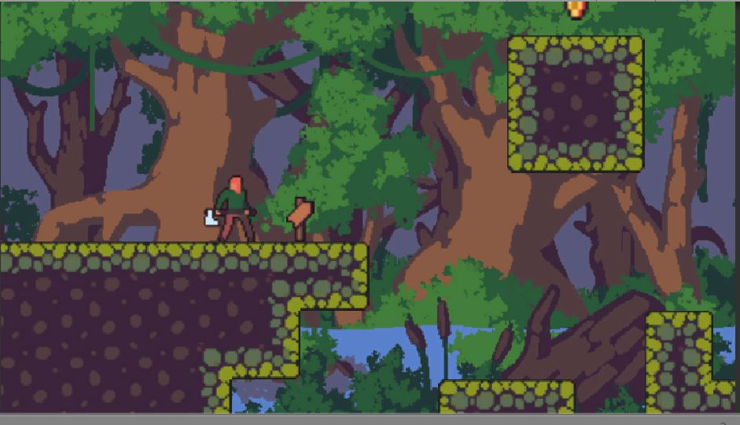

###### Guilherme Leite

Deployment: https://guipleite.github.io/2D-Plataformer/
2D plataform game made with unity

 
Movimento: S,D

Pulo: Barra de Espaço
Ataque: Botão esquerdo do mouse

O objetivo é pegar a moeda, se o jogador cair do mapa ou na água ele morre. Ele também pode quebrar caixas.
 

  

Sprites used: https://craftpix.net/freebies/free-3-character-sprite-sheets-pixel-art/
 
Tilemap used: https://craftpix.net/freebies/free-swamp-game-tileset-pixel-art/
